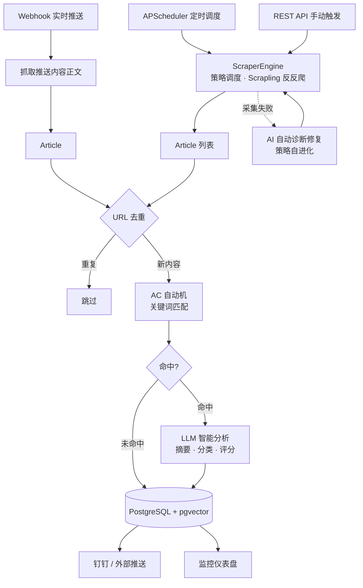
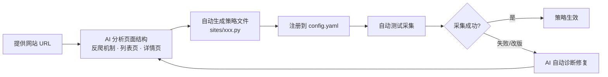

# Purchase Sentinel

通用网站信息采集与智能分析平台 — 爬虫策略 AI 自动生成、自动修复、持续进化。

## 核心价值

自动采集**任意网站**的内容，经关键词匹配命中后，由 **LLM 智能分析**生成摘要、分类与重要性评分，存储到 PostgreSQL 并推送至钉钉多维表格，同时在内嵌仪表盘上实时展示。

最大亮点：**爬虫策略由 AI 自动生成和修复**——你只需提供一个网站 URL，AI 会自动分析页面结构、生成采集策略、注册到系统。当目标网站改版导致采集失败时，AI 能自动诊断并修复策略，无需人工干预。

## 业务流程图



**触发方式**：① APScheduler 定时调度（支持按站点独立 cron）；② REST API 手动触发（全量 / 单站）；③ Webhook 实时推送。三条路径汇入同一条处理管道。

**自进化机制**：当采集策略因目标网站改版而失败时，系统自动触发 AI 诊断——重新分析页面结构，修复策略代码，重新注册生效。整个修复过程无需人工介入。

## 功能特性

- **AI 自动生成采集策略** — 提供网站 URL，AI 自动分析页面结构、反爬机制，生成完整策略文件并注册到系统
- **AI 自动修复失效策略** — 网站改版导致采集失败时，AI 自动诊断问题、重新分析页面结构、修复策略代码
- **策略模式架构** — 每个站点一个独立策略文件（~50-100 行），引擎管调度/重试/日志，策略只管"怎么抓怎么解析"
- **AC 自动机关键词匹配** — 基于 pyahocorasick，O(n) 复杂度扫描自定义关键词，关键词可通过仪表盘动态增删
- **LLM 智能分析** — httpx 直连 OpenAI 兼容端点，生成摘要、分类、重要性评分（1-5）
- **FastAPI 内嵌监控仪表盘** — 暗色主题，自动刷新，展示统计、文章列表（筛选/搜索）、站点状态、调度与关键词管理
- **APScheduler 定时调度** — 支持按站点独立 cron 配置，支持 API 动态调整
- **Webhook 实时推送接入** — 接收外部内容推送（如微信公众号文章），自动抓取正文后进入处理管道
- **多渠道推送** — 命中关键词的文章自动推送到钉钉多维表格，支持补推历史未推送内容
- **URL 去重** — MD5 哈希（http/https 归一化）确保同一内容不重复入库
- **错误隔离** — 单篇失败不影响其他文章；LLM 失败时文章照常入库并记录失败原因
- **Docker Compose 一键部署** — PostgreSQL (pgvector) + App 双服务编排

## 涉及第三方软件

| 软件 | 角色 | 说明 |
|------|------|------|
| **Scrapling** | 网页采集引擎 | 处理 TLS 指纹、反爬绕过；标准站点用 `Fetcher.get()`，高强度反爬站点用 `StealthyFetcher` 无头浏览器 |
| **PostgreSQL + pgvector** | 主数据库 | 文章、关键词、调度配置、采集记录均存于此；pgvector 为未来语义搜索预留 |
| **OpenAI 兼容 LLM 端点** | AI 分析 + 策略生成/修复引擎 | 通过 httpx 调用 `chat/completions`，负责文章分析（摘要/分类/评分）和采集策略的自动生成与修复 |
| **Camoufox** | 无头浏览器 | Scrapling StealthyFetcher 底层浏览器（Firefox 内核），用于绕过 JS 挑战类反爬 |

> 系统不绑定特定推送渠道或内容源——钉钉多维表格是内置的推送实现之一，Webhook 接入支持任意外部内容推送。可根据需要扩展其他推送渠道。

## 技术栈

| 技术 | 版本 | 用途 |
|------|------|------|
| Python | 3.11+ | 运行时 |
| FastAPI | 0.115+ | REST API + 内嵌仪表盘 |
| PostgreSQL + pgvector | 16+ | 主数据库 + 未来向量搜索 |
| psycopg v3 + psycopg-pool | 3.3+ | 异步数据库驱动（AsyncConnectionPool） |
| Scrapling | 0.4.7+ | 反反爬 Web 采集引擎 |
| APScheduler | 3.11+ | 进程内定时调度 |
| pyahocorasick | 2.3+ | AC 自动机多关键词匹配 |
| httpx | 0.28+ | 异步 HTTP 客户端（LLM 调用） |
| Jinja2 | 3.1+ | 仪表盘 HTML 模板渲染 |
| pydantic | 2.12+ | 数据模型与校验 |
| Docker Compose | v2+ | 容器编排部署 |

## 项目结构

```
purchase-sentinel/
├── app/                    # 应用核心代码
│   ├── main.py             # FastAPI 入口、路由、APScheduler 调度、Webhook
│   ├── database.py         # 异步数据库连接池与查询
│   ├── models.py           # Article 数据模型（Pydantic）
│   ├── engine.py           # 采集引擎 + 公共 http_get 请求封装
│   ├── pipeline.py         # 处理管道协调器（去重→匹配→AI→入库→推送）
│   ├── llm_client.py       # LLM 客户端（chat/completions）
│   ├── dingtalk_client.py  # 钉钉多维表格 API 客户端
│   ├── keyword_matcher.py  # AC 自动机关键词匹配
│   ├── base_strategy.py    # 采集策略基类（BaseSiteStrategy）
│   ├── config.py           # 策略加载器（读取 config.yaml，importlib 动态导入）
│   └── templates/          # Jinja2 仪表盘模板
│       ├── dashboard.html
│       └── schedule.html
├── sites/                  # 采集策略（按需添加，AI 自动生成）
│   └── __init__.py
├── tests/                  # 测试
├── config.yaml             # 站点注册表（唯一注册入口）
├── docker-compose.yml      # Docker 编排（postgres + app）
├── docker-compose.prod.yml # 生产覆盖配置（host 网络）
├── Dockerfile              # 多阶段构建
├── requirements.txt        # Python 依赖
├── run.py                  # 启动入口
├── init-db.sql             # 数据库初始化脚本
└── .env.example            # 环境变量模板
```

## 本地部署

### 前置条件

- Python 3.11+
- PostgreSQL 16+（需安装 pgvector 扩展）
- 可访问的 OpenAI 兼容 LLM 端点

### 步骤

**1. 克隆仓库并安装依赖**

```bash
git clone https://github.com/dzLin1820372845/purchase-sentinel.git
cd purchase-sentinel
python -m venv venv

# Linux / macOS
source venv/bin/activate
# Windows
venv\Scripts\activate

pip install -r requirements.txt
```

**2. 配置环境变量**

```bash
cp .env.example .env
```

编辑 `.env`，填入数据库连接、LLM 端点、推送凭证（见[环境变量说明](#环境变量说明)）。

**3. 准备数据库**

```bash
createdb -U postgres sentiment
psql -U postgres -d sentiment -f init-db.sql
```

**4. 启动应用**

```bash
python run.py
```

**5. 访问仪表盘**

浏览器打开 http://localhost:8000

## Docker 部署

```bash
cp .env.example .env
# 编辑 .env 填入配置
docker compose up -d
```

生产环境（Linux）使用 host 网络模式解决 TLS 兼容问题：

```bash
docker compose -f docker-compose.yml -f docker-compose.prod.yml up -d
```

## 环境变量说明

### PostgreSQL 配置

| 变量 | 默认值 | 说明 |
|------|--------|------|
| `POSTGRES_USER` | `sentiment` | 数据库用户名 |
| `POSTGRES_PASSWORD` | `sentiment_dev` | 数据库密码（生产环境务必修改） |
| `POSTGRES_DB` | `sentiment` | 数据库名 |
| `PG_PORT` | `5432` | PostgreSQL 对外端口 |
| `DATABASE_URL` | -- | 完整连接字符串（本地开发使用，Docker 环境自动构造） |

### LLM 配置

| 变量 | 默认值 | 说明 |
|------|--------|------|
| `LLM_BASE_URL` | `https://api.example.com/v1` | OpenAI 兼容端点地址 |
| `LLM_API_KEY` | -- | 端点 API Key |
| `LLM_MODEL` | `deepseek-v4-pro` | 模型名（小写，端点大小写敏感） |

### 钉钉推送配置

| 变量 | 说明 |
|------|------|
| `DINGTALK_APP_KEY` | 钉钉应用 AppKey |
| `DINGTALK_APP_SECRET` | 钉钉应用 AppSecret |
| `DINGTALK_BASE_ID` | 多维表格 Base ID |
| `DINGTALK_SHEET_NAME` | 多维表格数据表名 |
| `DINGTALK_OPERATOR_ID` | 钉钉操作者 ID |

## 添加采集站点

### 策略自进化工作流



系统采用**策略模式**：`ScraperEngine` 管调度、重试、日志；每个站点一个策略文件，只管"这个站怎么抓、怎么解析"。

**添加新站点只需**：
1. 提供目标网站 URL（和需要采集的板块/栏目）
2. AI 自动分析页面结构、反爬机制，生成策略文件
3. 策略注册到 `config.yaml` 后自动生效

**策略自动修复**：
- 当目标网站改版导致采集失败（HTTP 错误、解析异常、内容为空），系统检测到失败
- AI 重新分析变化后的页面结构，自动修复策略代码
- 修复后的策略自动重新注册并测试

### 策略开发接口

每个策略继承 `BaseSiteStrategy`，实现两个方法：

| 方法 | 职责 |
|------|------|
| `fetch_latest() -> list[Article]` | 获取最新文章列表（返回 Article 列表） |
| `fetch_article(url) -> Article` | 获取单篇文章详情（返回完整 Article） |

引擎统一处理：HTTP 请求封装（`http_get`，含 TLS 指纹、自动重试、频率控制）、错误隔离（单篇失败不中断）、日志记录。策略文件不需要关心这些。

### 引擎公共能力

| 能力 | 说明 |
|------|------|
| `http_get()` | 统一 HTTP 请求：TLS 指纹模拟、stealthy_headers、应用层重试、可配置频率间隔 |
| `regex_find_date()` | 正则兜底日期提取，支持 `YYYY-MM-DD`、`YYYY年MM月DD日` 等格式 |
| `StealthyFetcher` | Scrapling 无头浏览器模式，用于 JS 挑战类反爬站点（如瑞数） |

## 许可证

[MIT License](LICENSE)
