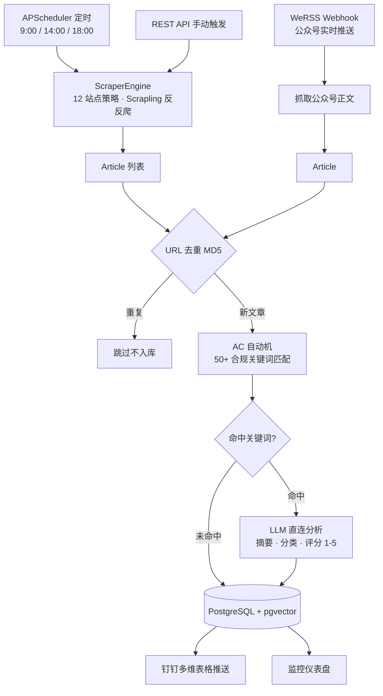
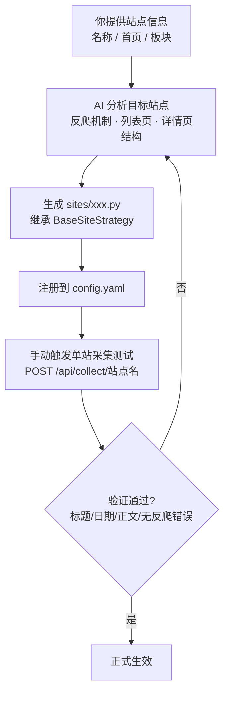

# 采购舆情检测系统 (Purchase Sentiment Monitor)

医疗行业采购合规舆情自动采集、AI 分析与推送系统。

## 核心价值

自动采集**政府监管网站**和**微信公众号**的监管文章，经关键词匹配命中后，由 **LLM 直连分析**生成摘要、分类与重要性评分，存储到 PostgreSQL，并把高分文章推送至**钉钉多维表格**，同时在内嵌仪表盘上展示今日动态。帮助采购团队及时掌握合规动态，规避采购合规风险。

## 业务流程图



**触发方式**：① APScheduler 定时（默认每天 9:00 / 14:00 / 18:00，支持按站点独立配置）；② REST API 手动触发（全量 / 单站）；③ WeRSS 实时推送公众号文章。三条路径汇入同一条处理管道。

## 功能特性

- **多站点策略采集** -- 12 个站点，策略模式设计，新增站点只需写策略文件 + 注册 `config.yaml`，无需改动引擎代码
- **AC 自动机多关键词匹配** -- 基于 pyahocorasick，O(n) 复杂度扫描 50+ 合规关键词，关键词可通过仪表盘动态增删
- **LLM 直连 AI 分析** -- httpx 直接调用 OpenAI 兼容 chat/completions 端点，生成中文摘要、分类（食品/化妆品/药品/医疗器械/综合）、重要性评分（1-5）
- **FastAPI 内嵌监控仪表盘** -- 暗色主题，自动刷新，展示今日统计、文章列表（筛选/搜索）、站点采集状态、调度与关键词管理
- **APScheduler 定时调度** -- 默认每天 9:00 / 14:00 / 18:00 自动采集，支持按站点独立 cron，支持 API 动态调整
- **手动触发采集** -- REST API 支持全量采集或单站点采集，正在采集时返回 409 避免并发
- **WeRSS 微信公众号 Webhook** -- 接收 WeRSS 推送的公众号文章，自动抓取正文后进入处理管道
- **钉钉 AI 多维表格推送** -- 自动将命中关键词的文章推送到钉钉多维表格，采集完成后自动补推历史未推送文章
- **URL 去重** -- MD5 哈希（http/https 归一化）确保同一文章不重复入库
- **错误隔离** -- 单篇失败不影响其他文章；LLM 失败时文章照常入库并记录失败原因
- **Docker Compose 一键部署** -- PostgreSQL (pgvector) + App 双服务编排，NAS 生产环境提供 host 网络覆盖配置

## 涉及第三方软件

| 软件 | 角色 | 说明 |
|------|------|------|
| **Scrapling** | 网页采集引擎 | 处理 TLS 指纹、反爬绕过；标准站点用 `Fetcher.get()`，瑞数反爬站点（海关总署）用 `StealthyFetcher` 无头浏览器 |
| **WeRSS** | 微信公众号订阅网关 | 独立运行的 Docker 容器（:8001），订阅 37 个公众号，新文章实时推送到本系统的 `/api/werss/webhook` |
| **PostgreSQL + pgvector** | 主数据库 | 文章、关键词、调度配置、采集失败记录均存于此；pgvector 为未来 RAG 语义搜索预留 |
| **OpenAI 兼容 LLM 端点** | AI 分析引擎 | 通过 httpx 直接调用 `chat/completions`，生成摘要/分类/评分；默认 `https://www.lordfine.top/v1`，模型 `deepseek-v4-pro` |
| **钉钉 (DingTalk)** | 推送目标 | 通过钉钉开放平台 AppKey/Secret 调用多维表格 API，写入高分文章 |
| **Camoufox** | 无头浏览器 | Scrapling StealthyFetcher 底层浏览器（Firefox 内核），用于绕过 JS 挑战类反爬 |

> WeRSS 是独立于本系统的外部服务，只需在 WeRSS 配置中把推送地址指向本系统 Webhook 即可接入，本系统不做公众号抓取。

## 技术栈

| 技术 | 版本 | 用途 |
|------|------|------|
| Python | 3.11+ | 运行时 |
| FastAPI | 0.115+ | REST API + 内嵌仪表盘 |
| PostgreSQL + pgvector | 16+ | 主数据库 + 未来向量搜索 |
| psycopg v3 + psycopg-pool | 3.3+ | 异步数据库驱动（AsyncConnectionPool） |
| Scrapling | 0.4.7+ | 反反爬 Web 采集引擎 |
| APScheduler | 3.11+ | 进程内定时调度 |
| pyahocorasick | 2.3+ | AC 自动机多关键词匹配 |
| httpx | 0.28+ | 异步 HTTP 客户端（LLM 调用） |
| Jinja2 | 3.1+ | 仪表盘 HTML 模板渲染 |
| pydantic | 2.12+ | 数据模型与校验 |
| Docker Compose | v2+ | 容器编排部署 |

## 项目结构

```
purchase_monitor/
├── app/                    # 应用核心代码
│   ├── main.py             # FastAPI 入口、路由、APScheduler 调度、WeRSS webhook
│   ├── database.py         # 异步数据库连接池与查询
│   ├── models.py           # Article 数据模型（Pydantic）
│   ├── engine.py           # 采集引擎 + 公共 http_get 请求封装
│   ├── pipeline.py         # 处理管道协调器（去重→匹配→AI→入库→推送）
│   ├── llm_client.py       # LLM 直连客户端（chat/completions）
│   ├── dingtalk_client.py  # 钉钉多维表格 API 客户端
│   ├── keyword_matcher.py  # AC 自动机关键词匹配
│   ├── base_strategy.py    # 采集策略基类（BaseSiteStrategy）
│   ├── config.py           # 策略加载器（读取 config.yaml，importlib 动态导入）
│   └── templates/          # Jinja2 仪表盘模板
│       ├── dashboard.html
│       └── schedule.html
├── sites/                  # 采集站点策略（12 个）
│   ├── nmpa.py             # 国家药监局
│   ├── sh_yjj.py           # 上海药监局
│   ├── nhc.py              # 国家卫生健康委员会
│   ├── cfdi.py             # 食品药品审核查验中心
│   ├── customs.py          # 海关总署（StealthyFetcher 无头浏览器）
│   ├── samr.py             # 国家市场监督管理局
│   ├── foodmate.py         # 食品资讯中心
│   ├── foodmate_law.py     # 食品法规中心
│   ├── exim.py             # 进出口食品安全信息平台
│   ├── foodaily.py         # 每日食品网
│   ├── yaozh.py            # 药智网
│   └── herbridge.py        # 植提桥
├── tests/                  # 测试
├── config.yaml             # 站点注册表（唯一注册入口）
├── docker-compose.yml      # Docker 编排（postgres + app）
├── docker-compose.prod.yml # NAS 生产覆盖配置（host 网络）
├── Dockerfile              # 多阶段构建
├── requirements.txt        # Python 依赖
├── run.py                  # 启动入口（Windows 自动切换 SelectorEventLoop）
├── init-db.sql             # 数据库初始化脚本
└── .env.example            # 环境变量模板
```

## 本地部署（推荐：python run.py）

系统可直接以 Python 进程方式运行，无需 Docker，适合开发机与 Windows/Linux 服务器。

### 前置条件

- Python 3.11+
- PostgreSQL 16+（需安装 pgvector 扩展）
- 可访问的 OpenAI 兼容 LLM 端点（默认 `https://www.lordfine.top/v1`）
- 可选：WeRSS 容器（:8001）用于接收公众号文章

### 步骤

**1. 克隆仓库并安装依赖**

```bash
git clone <repo-url>
cd purchase_monitor
python -m venv venv

# Linux / macOS
source venv/bin/activate
# Windows
venv\Scripts\activate

pip install -r requirements.txt
```

**2. 配置环境变量**

```bash
cp .env.example .env
```

编辑 `.env`，填入数据库连接、LLM 端点、钉钉凭证（见[环境变量说明](#环境变量说明)）。

**3. 准备数据库**

```bash
createdb -U postgres sentiment
psql -U postgres -d sentiment -f init-db.sql
```

**4. 启动应用**

```bash
python run.py
```

Windows 下 `run.py` 会自动强制使用 SelectorEventLoop（psycopg 异步连接池兼容要求）。

**5. 访问仪表盘**

浏览器打开 http://localhost:8000

### 接入 WeRSS 公众号推送（可选）

1. 启动 WeRSS 容器并订阅公众号（WeRSS 运行在 `:8001`）
2. 在 WeRSS 中把文章推送地址配置为本系统的 `http://<本机IP>:8000/api/werss/webhook`
3. 公众号新文章会实时进入处理管道（自动抓取正文 → 关键词匹配 → AI 分析 → 入库 → 推送）

## Docker 部署（生产环境 / NAS）

Docker Compose 编排两个服务：`postgres`（pgvector/pgvector:pg16）和 `app`。postgres 健康检查通过后 app 才启动，`init-db.sql` 通过 volume mount 自动执行。

### 步骤

**1. 配置环境变量**

```bash
cp .env.example .env
```

编辑 `.env`，修改以下关键配置：

- `POSTGRES_PASSWORD` -- 设置强密码
- `LLM_BASE_URL` / `LLM_API_KEY` / `LLM_MODEL` -- LLM 直连端点（模型名小写，端点大小写敏感）
- `DINGTALK_*` -- 钉钉应用凭证

> 注意：Docker 环境中 `DATABASE_URL` 由 `docker-compose.yml` 自动构造（使用容器间 DNS 主机名 `postgres`），无需手动修改。

**2. 一键启动**

```bash
docker compose up -d
```

**3. 查看 / 停止**

```bash
docker compose logs -f app
docker compose down
```

数据持久化在 Docker volume `pgdata` 中，`down` 不会删除数据。如需清除数据：`docker compose down -v`。

### NAS 生产部署（Linux）

政府站点 TLS 兼容问题需使用 host 网络模式：

```bash
docker compose -f docker-compose.yml -f docker-compose.prod.yml up -d
```

`docker-compose.prod.yml` 将 app 切换为 `network_mode: host`，并让 app 通过 `localhost` 连接数据库。

## 环境变量说明

### PostgreSQL 配置

| 变量 | 默认值 | 说明 |
|------|--------|------|
| `POSTGRES_USER` | `sentiment` | 数据库用户名 |
| `POSTGRES_PASSWORD` | `sentiment_dev` | 数据库密码（生产环境务必修改） |
| `POSTGRES_DB` | `sentiment` | 数据库名 |
| `PG_PORT` | `5432` | PostgreSQL 对外端口 |
| `DATABASE_URL` | -- | 完整连接字符串（本地开发使用，Docker 环境自动构造） |

### LLM 直连配置

| 变量 | 默认值 | 说明 |
|------|--------|------|
| `LLM_BASE_URL` | `https://www.lordfine.top/v1` | OpenAI 兼容端点地址 |
| `LLM_API_KEY` | -- | 端点 API Key |
| `LLM_MODEL` | `deepseek-v4-pro` | 模型名（**小写**，端点大小写敏感，大写会 404） |

### 钉钉配置

| 变量 | 说明 |
|------|------|
| `DINGTALK_APP_KEY` | 钉钉应用 AppKey |
| `DINGTALK_APP_SECRET` | 钉钉应用 AppSecret |
| `DINGTALK_BASE_ID` | 多维表格 Base ID |
| `DINGTALK_SHEET_NAME` | 多维表格数据表名 |
| `DINGTALK_OPERATOR_ID` | 钉钉操作者 ID |

## 扩展新采集站点

系统采用**策略模式**：`ScraperEngine` 管调度、重试、日志；每个站点一个策略文件，只管"这个站怎么抓、怎么解析"。新增站点分四步：**提供信息 → AI 生成 → 注册 → 测试**。

### 你需要提供的信息

| 信息 | 说明 | 示例 |
|------|------|------|
| 站点名称 | 用于标识站点 | `国家药监局` |
| 站点首页 URL | 站点主域名或入口页 | `https://www.nmpa.gov.cn` |
| 采集板块 | 要采集的栏目/分类及列表页 URL | `药品-监管工作: https://www.nmpa.gov.cn/yaopin/ypjgdt/` |
| URL 规律（可选） | 文章详情页 URL 格式 | `路径含 10 位数字 + .html` |
| 反爬情况（可选） | 是否有特殊请求头、验证码、封 IP 等 | `需 Sec-Fetch-* 请求头` |
| 页面结构（可选） | 正文/标题/日期的选择器 | `正文: #ivs_content` |

> **最简方式**：给一个板块列表页 URL 和一篇文章详情页 URL，由 AI 自行分析页面结构。

### AI 生成策略的工作流程



1. **你提供**：站点名称 + 首页 URL + 采集板块（可选补充 URL 规律、反爬、页面结构信息）
2. **AI 动作**：
   - 调用 Claude Code 的 **`scraping-strategy`** Skill，并参考 `采集引擎-策略模式技术文档.md`
   - 阅读 `sites/nmpa.py` 等现有策略作为样板
   - 分析目标站点的列表页和详情页 HTML 结构、反爬机制
   - 生成 `sites/xxx.py` 策略文件（继承 `BaseSiteStrategy`，实现 `fetch_latest` / `fetch_article`）
   - 在 `config.yaml` 注册一条配置（`strategy: sites.xxx:XxxStrategy`）
3. **测试**：调用单站采集接口验证

```bash
curl -X POST http://localhost:8000/api/collect/站点中文名
```

4. **验证清单**：每个板块拿到最新文章、标题非空非乱码、日期已提取、正文非空、无 412/403 错误、无异常堆栈
5. **生效**：注册到 `config.yaml` 后重启应用自动加载；策略文件约 50-100 行，无需改动引擎代码

### 现有站点策略参考

| 策略文件 | 站点 | 特点 |
|----------|------|------|
| `sites/nmpa.py` | 国家药监局 | 需 `Sec-Fetch-*` 请求头（否则 412），请求间隔 ≥5 秒，正文多选择器兜底 |
| `sites/sh_yjj.py` | 上海药监局 | 结构简单，标准请求 |
| `sites/nhc.py` | 国家卫健委 | 相对简单，列表+详情两层结构 |
| `sites/cfdi.py` | 审核查验中心 | 拒绝 google.com Referer，需显式设置站点 Referer |
| `sites/customs.py` | 海关总署 | **瑞数反爬**，需 `StealthyFetcher` 无头浏览器 |
| `sites/samr.py` | 市场监管总局 | 页面缓存去重，政策文件板块 JS 渲染需回退处理 |
| `sites/foodmate.py` | 食品资讯中心 | 标准请求 |
| `sites/foodmate_law.py` | 食品法规中心 | 3 种列表解析逻辑 |
| `sites/exim.py` | 进出口食品安全 | 按国家/地区划分板块 |
| `sites/foodaily.py` | 每日食品网 | 详情页仅有相对日期，需从列表页提取日期 |
| `sites/yaozh.py` | 药智网 | 3 种详情页类型，板块靠 onclick 属性映射 |
| `sites/herbridge.py` | 植提桥 | 固定列表 URL |

### 反爬处理提示

部分站点需要特殊处理：
- **Sec-Fetch 请求头**：NMPA 等政府站点需要，缺失返回 412
- **浏览器渲染**：海关总署使用瑞数反爬，通过 Scrapling `StealthyFetcher`（Camoufox 无头浏览器）绕过
- **Referer 定制**：CFDI 拒绝 google.com 来源，需覆盖默认 Referer
- **频率控制**：`http_get(retry_delay=5)` 控制请求间隔

## 许可证

[MIT License](LICENSE)
